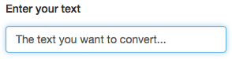
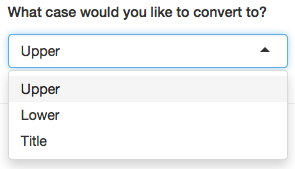

## Text string case converter

#### Convert text with ease

---

### Everyone has had this problem...

* You've got a chunk of text that needs case converting
* Your options:
    1. Manually type out everything again in your desired case
    2. Use the **Text string case converter**

---

### It's easy...
* Enter the text you would like to convert into a text box.



* Choose the type of conversion you would like from a dropdown list.



* Your converted text will then appear under the _Converted text_ heading.

---

### Upper case conversion
* **Convert this**:
```
"I really wish I could make this text all UPPER case."
```
* **to this**:

```
## [1] "I REALLY WISH I COULD MAKE THIS TEXT ALL UPPER CASE."
```

### Lower case conversion
* **Convert this**:
```
"MAKE ME lower CASE please."
```
* **to this**:

```
## [1] "make me lower case please."
```

### Title case conversion
* **Convert this**:
```
"THERE ARE TOO MANY CAPS IN THIS."
```
* **to this**:

```
## [1] "There Are Too Many Caps In This."
```

---

## Get started now!

[Click here to view the app](https://nevermiss.shinyapps.io/course_project)
